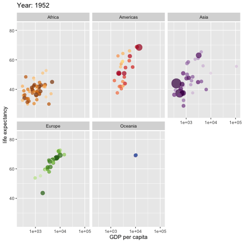

```{r setup, include=FALSE}
knitr::opts_chunk$set(echo = TRUE)
```

## I. Opening 

### "Bubble plot"

```{r cars}
## from http://r-statistics.co/Top50-Ggplot2-Visualizations-MasterList-R-Code.html
## load package and data
library(ggplot2)
data(mpg, package="ggplot2")
mpg_select <- mpg[mpg$manufacturer %in% c("audi", "ford", "honda", "hyundai"), ]

# Scatterplot
theme_set(theme_bw())  # pre-set the bw theme.
g <- ggplot(mpg_select, aes(displ, cty)) + 
  labs(subtitle="mpg: Displacement vs City Mileage",
       title="Bubble chart")

g + geom_jitter(aes(col=manufacturer, size=hwy)) + 
  geom_smooth(aes(col=manufacturer), method="lm", se=F)
```

### Cool R example: from Hans Rosling <https://www.ted.com/speakers/hans_rosling> gapminder

```{r gganimate, echo=TRUE, eval = FALSE}
library(ggplot2)
library(gganimate)
library(gapminder)

ggplot(gapminder, aes(gdpPercap, lifeExp, size = pop, colour = country)) +
  geom_point(alpha = 0.7, show.legend = FALSE) +
  scale_colour_manual(values = country_colors) +
  scale_size(range = c(2, 12)) +
  scale_x_log10() +
  facet_wrap(~continent) +
  # Here comes the gganimate specific bits
  labs(title = 'Year: {frame_time}', x = 'GDP per capita', y = 'life expectancy') +
  transition_time(year) +
  ease_aes('linear')

anim_save("gapminder.gif")

```



### Start-of-class work

1. Log in the your workstation.
2. Open the RStudio application on your machine.

### Why statisticians learn to program

- **Independence**: otherwise, you rely on someone else giving you exactly the right tool
- **Honesty**: otherwise, you end up distorting your problem to match the tools you have
- **Clarity**: often, turning your ideas into something a machine can do refines your thinking
- **Fun**: these were the best of times (the worst of times)
- **Engineering**: build tools for someone to actually use.

## II. How this class will work

- Instructor: A. Grant Schissler
- Not much programming knowledge assumed
- Some statistics knowledge assumed
- Focus is almost entirely on R 
- Class will be cumulative, so keep up with the material and assignments!
- Assignments typically due Friday at 5:00pm.
- Hybrid class: Online requirements and in-class lectures/tactivities
- I'll use a variety of instructional in-class activites: lecture, quick activities, more involved "lab" assignments, and student-led presentations.
- I often break classes into 10-20 minute "segments" to introduce concepts.
- **Ask Questions** and **Work Together** --- these are the most important reasons for class time.

### I do
- Let's tour to our [course website](http://www.grantschissler.com/teaching/FA18/STAT445/).

### We do
- Please visit the website and click around.
- Let me know if there are errors or issues.

### You do
- Download [intro.Rmd](https://github.com/grizant/STAT445/blob/master/lesson1_intro/rmd/intro.Rmd), an R Markdown file from the website or using git.

## III. Using R/RStudio to produce HTML, PDF, or Word documents

R, R Studio, R Markdown

- R is a programming language for statistical computing
- R Studio is an integrated development environment for R programming  
- R Markdown is a markup language for combining R code with text

All 3 are free, and all 3 will be used extensively in this course.

### I do
1. Open the .Rmd file in RStudio producing these slides.
2. Compile the .Rmd to produce an html file.

### We do
Please compile the slides using RStudio.

### You do
1. Play around with RStudio.
2. Can you produce a different backend for our slides - like slides, Word, or PDF?

## IV. Introduction to DataCamp

- DataCamp is a Data Science instructional program
- I've designed a course of study for you.
- But you all have different experiences -- I'll try to personalize as needed.
- DataCamp works on all devices.
- DataCamp assignments should take between 3-4 hours a week.
- (Hopefully) you can earn special certificates in DataCamp for your resume/CV.
- If you only have access to assigned modules, I'll add "optional" modules. WebCampus will reflect the true assigned modules, indicated by DataCamp:<Module name>.
- You may want to bring headphones to class if you have time to listen to online modules.

### I do
- I'll log in and point of a few features (modules, skill tracks, etc.)
- [Datacamp](https://www.datacamp.com/).
- Let's check out the assigned and recommended modules <https://github.com/grizant/STAT445/blob/master/DataCamp/tex/STAT445-645-Intro-to-Stats-Computing-DataCampModules.pdf>.
- I'll store some DataCamp code in a .R script.

### We do
1. Please log in. 
2. What modules do you have access to? Only those assigned? 

### You do
- Play around and let me know if you have any questions.
- Store some DataCamp code in a .R script.

## V. Closing
Please answer the following questions: "What?", "So what?", "Now what?".
