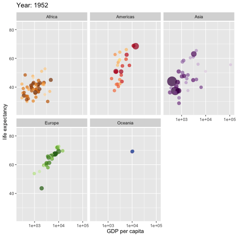

```{r setup, results='none'}
knitr::opts_chunk$set(cache=TRUE, autodep=TRUE, cache.comments=TRUE)
library(readxl)
library(scales)
library(tidyverse)
```

## I. Opening (25 min)

### Think-pair-share (5 min)

1. Think: Reflect on the code and R gif produced below. What do you notice about the code? How the plot was constructed? What trends do you see in the plots?
2. Pair: Discuss with your neighbor(s). Please introduce yourselves as needed.
3. Share: When prompted, share your observations/comments/questions with the class (see below).  

### Interactive R viz: from Hans Rosling <https://www.ted.com/speakers/hans_rosling> gapminder

```{r gganimate, echo=TRUE, eval = FALSE}
library(ggplot2)
library(gganimate)
library(gapminder)

ggplot(gapminder, aes(gdpPercap, lifeExp, size = pop, colour = country)) +
  geom_point(alpha = 0.7, show.legend = FALSE) +
  scale_colour_manual(values = country_colors) +
  scale_size(range = c(2, 12)) +
  scale_x_log10() +
  facet_wrap(~continent) +
  # Here comes the gganimate specific bits
  labs(title = 'Year: {frame_time}', x = 'GDP per capita', y = 'life expectancy') +
  transition_time(year) +
  ease_aes('linear')

anim_save("assets/gapminder.gif")

```



### Discuss as a group what trends are shown by this choice of vizulations. (10 min)

- How do trends change over time?
- How do continents compare?
- Other thoughts?

### Opening thoughts on stats computing (10 min)

- Modern statistical work relies on computing to manage data, clean/organize data, run analyses, summarize data, visualize data, estimate parameter,s conduct inference, prototype new methods, evaluate methods, compute quantities (almost always some type of integral or optimization), document/reproduce analyzes, and building reports/papers/talks.

- Phew! While there are a few statisticians that avoid computing and stick to theory/symbolic manipulations. While others avoid programming and stick with point-and-click interfaces for conventional routines. But the vast majority of statisticians program to get the job done.
 
#### Why statisticians/applied mathematicians learn to program

- **Independence**: otherwise, you rely on someone else giving you exactly the right tool
- **Honesty**: otherwise, you end up distorting your problem to match the tools you have
- **Clarity**: often, turning your ideas into something a machine can do refines your thinking
- **Fun**: these were the best of times (the worst of times)
- **Engineering**: build tools for someone to actually use.

- For me (and hopefully you all by the end of the term), we see statistical programming as an essential and integrated **thinking** tool. Without programming, it's nearly impossible to investigate and explore ideas, concepts, and to see bespoke and subtle patterns in the data.

## II. Our class community (20 min)

### Students: 

Undergraduate and graduate students (mostly) in stas/math, engineering, and computer science.
 
#### Activity

Please introduce yourself to your neighbor(s):

1) Name (what you liked to be called)
2) Major
3) Professional goals
4) (Appropriate) personal interests

Let's go around the room and everyone please (briefly) introduce your partner(s).

### TA/Grader: Alex Knudson, stats grad student

Alex, please introduce yourself.

### Instructor: A. Grant Schissler, PhD

- background: 6 years of high schools teaching, 5 years at higher Ed teaching
- education: BS in Applied Math, MS in Applied Stat, PhD in Statistics
- research interests: Statistical computing/simulation, Bayesian modeling, multivariate data, high-dimensional data, large-scale hypothesis testing, personalized medicine
- other interests: gaming, hiking/outdoors, tennis, running, ukulele

### Reciprocal interview

#### Questions for you:
1) What is statistical computing? (no searching for a definition)
2) What are your goals for the course?
3) What is your best outcome imagined for the course?
4) What is your worst outcome imagined for the course?
5) What is the most likely outcome imagined for the course?
6) What can I do to help you learn best? (feel free to chat with me individually)

#### Questions for me/Alex

Please, please, ask anything on your mind (about the class) --- anxieties, hopes, policies, procedures, anything. I answer briefly if I plan to talk more on a topic later.

### Take away

Assume good will among everyone here. **Ask Questions** and **Work Together** --- these are the most important reasons for class time.

## III. Course expectations and learning outcomes (25 min)

- Focus is on statistical computing ideas and techniques, both conceptually and practically.
- Using R is largely a skill and development takes effort and deliberate practice. This cannot be **passively** obtained by listening alone. So you'll code in R and Rmarkdown from the first day!
- Class will be cumulative, so keep up with the material and assignments!
- There will be online modules, coding assignments (labs), and in-class midterms (2).
- I'll use a variety of instructional in-class activites: lecture, distributed practice, computer lab, and paper assignments.
- I often break classes into 10-20 minute "segments" to introduce, develop, and reinforce concepts. Following the rough "I do", "we do", "you do" format.
- **Ask Questions** and **Work Together** --- these are the most important reasons for class time.

### Expectations for time committment

In-class activities require 2.5 hours/week.

```{r}
inclass_dat <- read_excel("../course_materials/Fall2019_inclass_schedule.xlsx")
## str(inclass_dat)

sum_dat <- inclass_dat %>%
  group_by(Activity) %>%
  summarise(Minutes = sum(Minutes), n = n())

sum_dat$Percent <- sum_dat$Minutes/sum(sum_dat$Minutes) * 100

sum_dat

bp <- ggplot(sum_dat, aes(x="", y=Percent, fill=Activity)) +
    geom_bar(width = 1, stat = "identity")
## bp

pie <- bp + coord_polar("y", start=0)
pie
```

Out-of-class activities depend on many individual factors. I'd regard these expected durations to be on the low end (it will likely take a bit longer).

```{r}
outclass_dat <- read_excel("../course_materials/Spring2019_outside_class_schedule.xlsx")
## str(outclass_dat)

## drop 'None' category
outclass_dat <- outclass_dat[outclass_dat$Activity != "None",]
outclass_dat$Activity <- factor(outclass_dat$Activity)

sum_dat <- outclass_dat %>%
  group_by(Activity) %>%
  summarise(Minutes = sum(Minutes), n = n())

sum_dat$Percent <- sum_dat$Minutes/sum(sum_dat$Minutes) * 100

sum_dat

## sum(sum_dat$Percent)

bp <- ggplot(sum_dat, aes(x="", y=Percent, fill=Activity)) +
    geom_bar(width = 1, stat = "identity")

pie <- bp + coord_polar("y", start=0)
pie
```

```{r}
## weekly expectation
sum_dat <- outclass_dat %>% group_by(Week) %>% summarise(Minutes = sum(Minutes), n = n())
cat(mean(sum_dat$Minutes)/60, "hours")
```

### Syllabus

[syllabus](https://github.com/grizant/Intro_Bayes_Course/blob/develop/syllabus/STAT446-646-Intro-to-Bayesian-Statistics-syllabus.pdf)

Think-pair-share

1. Please read the syllabus and list/mark 5 most important things.
2. Pair up and share your thought with your neighbor(s).
3. Share with the whole group.

### Detailed learning outcomes

[learning outcomes](https://github.com/grizant/Intro_Bayes_Course/blob/develop/course_materials/Intro-to-Bayesian-Statistics_learning_outcomes.pdf)

You can always ask, "How does this activity relate to the learning outcomes?". 

### Point-based grading system

Points are aligned with my valuation of the learning outcomes according to this matrix.

[Intro_Bayes_Course_course_assessment_plan.xlsx](https://github.com/grizant/Intro_Bayes_Course/blob/develop/course_materials/Intro_Bayes_Course_course_assessment_plan.xlsx)


```{r}
points_dat <- read_excel("~/OneDrive - University of Nevada, Reno/Teaching/Bayes_course/git_public/course_materials/Spring2019_points_time.xlsx")
## str(outclass_dat)

## scatterplot
sp <- ggplot(points_dat, aes(x=Week, y=cumsum(Points), color=Activity)) + geom_point() + labs(y="Cumulative point total")
sp

```

### Course resources

#### Website

Let's tour the website:

[course website](http://www.grantschissler.com/teaching/SP19/STAT429/).

#### Canvas (WebCampus)

- Course announcements
- Official assignments and due dates
- Gradebook management
- Secure file submissions
- Secure file sharing
- Another way to message the instructor

#### DataCamp for online modules

[datacamp.com](https://www.datacamp.com/home)

Only three modules assigned, but DataCamp has a wealth of tutorials to supplement any gaps in your preparation or to accelerate your learning.

#### Term project

629 students are required to complete a term project with my guidance. More on this soon.

#### Github

[https://github.com/grizant/Intro_Bayes_Course/tree/develop](https://github.com/grizant/Intro_Bayes_Course/tree/develop)

## V. Closing (5 min). 3-2-1

- 3 next actions you need to take
- 2 things you learned
- 1 friend you made (you can count me if you like ;) )

Share with the class, not the friend part if it's embarrassing to say...
